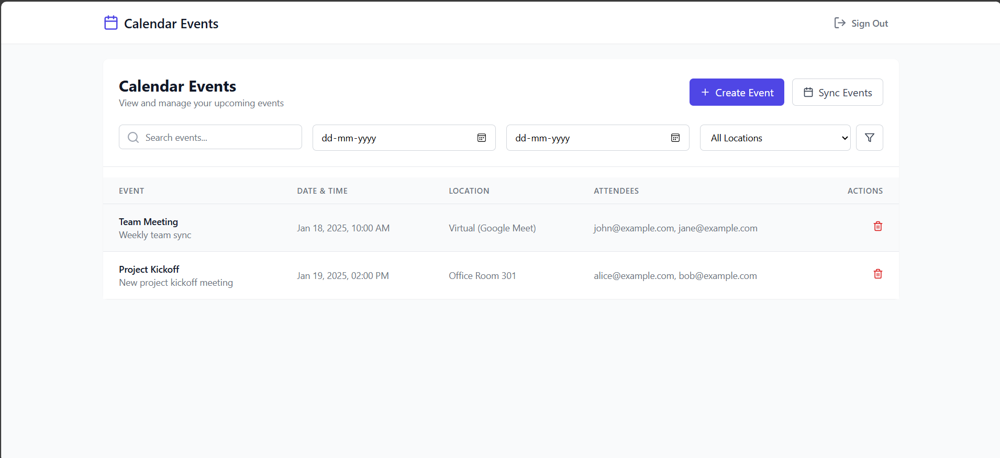

## About The Project

A modern web application that integrates with Google Calendar, providing a seamless and user-friendly interface for managing calendar events.



## Project Requirements

This project was developed to meet the following requirements:

### Core Features
- ✅ Google SSO Integration
- ✅ Google Calendar Events Display
- ✅ Event Filtering & Search
- ✅ Event Management (Create/Delete)

### Technical Requirements
- ✅ Secure Authentication
- ✅ API Integration
- ✅ Responsive UI/UX
- ✅ Code Quality & Organization

## Built With

* [![React][React.js]][React-url]
* [![TypeScript][TypeScript]][TypeScript-url]
* [![Vite][Vite]][Vite-url]
* [![Tailwind][Tailwind-css]][Tailwind-url]
* [![Supabase][Supabase]][Supabase-url]

## Getting Started

### Prerequisites

* Node.js (v18 or higher)
* npm
  ```sh
  npm install npm@latest -g
  ```
* A Supabase account
* A Google Cloud Console account

### Installation

1. Clone the repository
   ```sh
   git clone https://github.com/abhiguop/calendar-events.git
   ```
2. Install NPM packages
   ```sh
   npm install
   ```
3. Create `.env` file in the root directory and enter your API keys
   ```sh
   VITE_SUPABASE_URL=your_supabase_url
   VITE_SUPABASE_ANON_KEY=your_supabase_anon_key
   ```

### Google OAuth Setup

1. Go to [Google Cloud Console](https://console.cloud.google.com)
2. Create a new project
3. Enable Google Calendar API
4. Configure OAuth consent screen
5. Create OAuth 2.0 credentials
6. Add authorized redirect URIs:
   - `http://localhost:5173/calendar` (development)
   - Your production URL (if deploying)

### Supabase Setup

1. Create a new project in Supabase
2. Enable Google OAuth in Authentication > Providers
3. Add your Google OAuth credentials
4. Run the database migration:
   ```sh
   cd supabase
   supabase migration up
   ```

## Usage

To start the development server:

```sh
npm run dev
```

The application will be available at `http://localhost:5173`

## Features

### 1. Authentication
- Google SSO login
- Protected routes
- Token management

### 2. Calendar Integration
- View all calendar events
- Create new events
- Delete existing events
- Real-time sync with Google Calendar

### 3. User Interface
- Responsive design
- Modern UI with Tailwind CSS
- Intuitive event management
- Loading states and error handling

### 4. Search & Filter
- Date-based filtering
- Search by event title
- Filter by location

## Project Structure

```
├── src/
│   ├── components/        # UI components
│   ├── hooks/            # Custom React hooks
│   ├── lib/              # Utilities
│   ├── pages/            # Page components
│   └── types/            # TypeScript types
├── supabase/
│   └── migrations/       # Database migrations
└── package.json
```

## Available Scripts

- `npm run dev` - Start development server
- `npm run build` - Build for production
- `npm run preview` - Preview production build
- `npm run lint` - Run ESLint

## Database Schema

### user_tokens
- `id`: UUID (Primary Key)
- `user_id`: UUID (References auth.users)
- `access_token`: Text
- `refresh_token`: Text
- `expires_at`: Timestamp with timezone

## Contributing

1. Fork the Project
2. Create your Feature Branch (`git checkout -b feature/AmazingFeature`)
3. Commit your Changes (`git commit -m 'Add some AmazingFeature'`)
4. Push to the Branch (`git push origin feature/AmazingFeature`)
5. Open a Pull Request

## Acknowledgments

* [React Documentation](https://reactjs.org/)
* [Supabase Documentation](https://supabase.com/docs)
* [Google Calendar API](https://developers.google.com/calendar)
* [Tailwind CSS](https://tailwindcss.com/)

<!-- MARKDOWN LINKS & IMAGES -->
[React.js]: https://img.shields.io/badge/React-20232A?style=for-the-badge&logo=react&logoColor=61DAFB
[React-url]: https://reactjs.org/
[TypeScript]: https://img.shields.io/badge/TypeScript-007ACC?style=for-the-badge&logo=typescript&logoColor=white
[TypeScript-url]: https://www.typescriptlang.org/
[Vite]: https://img.shields.io/badge/vite-%23646CFF.svg?style=for-the-badge&logo=vite&logoColor=white
[Vite-url]: https://vitejs.dev/
[Tailwind-css]: https://img.shields.io/badge/Tailwind_CSS-38B2AC?style=for-the-badge&logo=tailwind-css&logoColor=white
[Tailwind-url]: https://tailwindcss.com/
[Supabase]: https://img.shields.io/badge/Supabase-3ECF8E?style=for-the-badge&logo=supabase&logoColor=white
[Supabase-url]: https://supabase.com/

